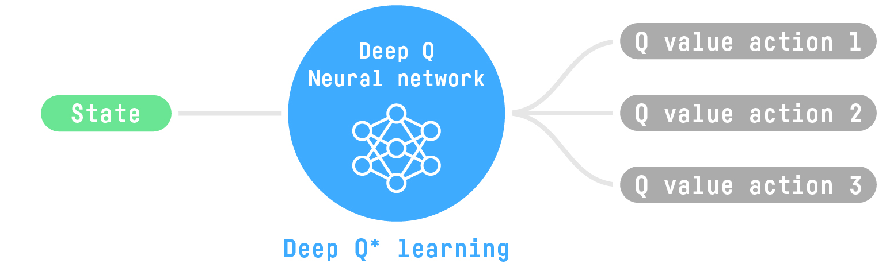

# Agenda

- \hyperlink{intro}{Introduction}

- \hyperlink{ddqn}{Dueling Deep Q Learning}

- \hyperlink{experiments}{Experiments}

- \hyperlink{conclusion}{Conclusion}

# 

\section{Introduction}
\label{intro}

# Introduction

Reinforcement learning is a powerful technique for training a computer to learn from experience. It is a method of constructing a policy that is able to learn from experience without being explicitly programmed.

There are many different types of reinforcement learning algorithms, but the most popular ones are Q-learning and SARSA (both seen in class during the course). All of them are based on Temporal Difference Learning (TDL).

# Q Learning basics

Q Learning is a method of RL that uses a reward-based system to learn from experience. The reward is based on the quality of the action taken, and this is basic to the reinforcement learning methods.

In the particular case of Q Learning, the values of the actions for a given state are stored in a table. The table is updated by the agent, and the agent is then able to choose the action that maximizes the value of the state.

# Q Learning basics

This works just fine for a simple example, but it is not very efficient for complex systems. The table is on itself a bottleneck, as the agent has to learn to find the optimal path through the table.

# Deep Learning

Deep Learning is a field in Machine Learning that is focused on learning from data. It is a method of learning that uses typically a neural network to learn from data. 

It is called Deep for using "deep" (a lot of layers) artificial neural networks.

It operates frequently under the supervised learning paradigm, where the agent is given a set of labelled data, and the agent is tasked with learning to predict the labels given the data.

# Deep Q Learning

Deep Q Learning operates just as Q Learning, but it uses a neural network to learn from experience. The role of the network in this algorithm is to serve as the table of values for the actions.

Instead of using a huge table of actions and states, the network is trained to learn the optimal action for a given state through the table.

{ width=70% }

# 

\section{Dueling Deep Q Learning}
\label{ddqn}

# Dueling Deep Q Learning

Given the agent's policy $\pi$, the action value and state value are defined as:

\begin{equation*}
Q^{\pi}(s,a) = \mathbb{E}[R_t | s_t = s, a_t = a, \pi]
\end{equation*}
\begin{equation*}
V^{\pi}(s,a) = \mathbb{E}_{a\sim \pi(s)}[Q^{\pi}(s,a)]
\end{equation*}

# Dueling Deep Q Learning

Which both can be written as:
\begin{equation*}
Q^{\pi}(s,a) = \mathbb{E}[r + \gamma \mathbb{E}[Q^{\pi}(s', a')] | s_t =s, a_t=a, \pi]
\end{equation*}

And then the advantage function is:
\begin{equation*}
A^{\pi}(s,a) = Q^{\pi}(s,a) - V^{\pi}(s,a)
\end{equation*}

Resulting of the subtraction of the state value from the action value. Intuitively, the advantage value shows how advantageous selecting an action is relative to the others at the given state.

# Dueling Deep Q Learning

By explicitly separating two estimators, the dueling architecture can learn which states are (or are not) valuable, without having to learn the effect of each action for each state.

# Dueling Deep Q Learning

In order to aggregate both values it seems obvious from the definition of the advantage value:

\begin{equation*}
Q(s,a;\theta, \alpha, \beta) = V(s; \theta, \beta) + A(s,a;\theta, \alpha)
\end{equation*}

# Dueling Deep Q Learning

However, it is problematic to assume that it gives reasonable estimates of the state-value and action advantages. Naively adding these two values can, therefore, be problematic.

The naive sum of the two is “unidentifiable,” in that given the Q value, we cannot recover the $V$ and $A$ uniquely. It is empirically shown in [@wang2016dueling] that this lack of identifiability leads to poor practical performance.

# Dueling Deep Q Learning

Therefore, the authors use a trick to approximate the state-value and action advantages in the last module of the neural network. Implementing a forward mapping like the following, which will force the Q value for maximizing the action to equal V, solving the identifiability issue:

\begin{equation*}
Q(s,a;\theta, \alpha, \beta) = V(s; \theta, \beta) + (A(s,a;\theta, \alpha) - \max_{a'\in |\mathcal{A}|} A(s,a;\theta,\alpha))
\end{equation*}

# Dueling Deep Q Learning

# Dueling Deep Q Learning

The learning process is the same as in Deep Q Learning [@Mnih2015] as the dueling architecture shares the same input-output interface. We define the loss of the model as the mean squared error between the Q value and the target Q value, and then take the gradient descent step.

\begin{equation*}
L(\theta) = \frac{1}{N} \sum_{i\in N}(Q_\theta (s_i, a_i) - Q_\theta^\star (s_i, a_i))^2
\end{equation*}

\begin{equation*}
Q_\theta^\star = R(s_t, a_t) + \gamma \max_{a_i'} Q_\theta(s_i', a_i')
\end{equation*}

# Dueling Deep Q Learning

# 

\section{Experiments}
\label{experiments}

# OpenAI Gym

OpenAI Gym [@gym] is a suite of environments for training reinforcement learning algorithms. It is a collection of environments that can be used to train a reinforcement learning agent.

Its popularity is due to its ability to train agents in a variety of environments, such as Atari games, and to provide a high-level interface for training agents in environments that are not easily accessible.

Since 2015, there have been lots of changes to the OpenAI Gym environment, and the environments are now more complex and challenging. 

# Experiments

There are a lot of papers that have been published about the OpenAI Gym environment, which has succeed in making progress in the reinforcement learning field as well as to make complex models more accessible.

For our experiments we have work with sevel environments of the OpenAI Gym. Which they belong to different categories, namely:

- Algorithms
- Atari
- Box2D
- Classic Control
- MuJoCo
- Robotics
- Toy Text
- Third Party Environments

# Experiments

We have work with the following environments:

- Space Invaders (Atari)
- Froze Lake (Toy Text)
- Lunar Lander (Box2D)

All in all we have used Python 3.9 and Tensorflow 2.x to create a framework with OpenAI Gym to train our agents with the aforementioned algorithms. In all cases they have been successful.

# Demo

{ width=70% }

# References {.allowframebreaks}

\bibliographystyle{apalike}
